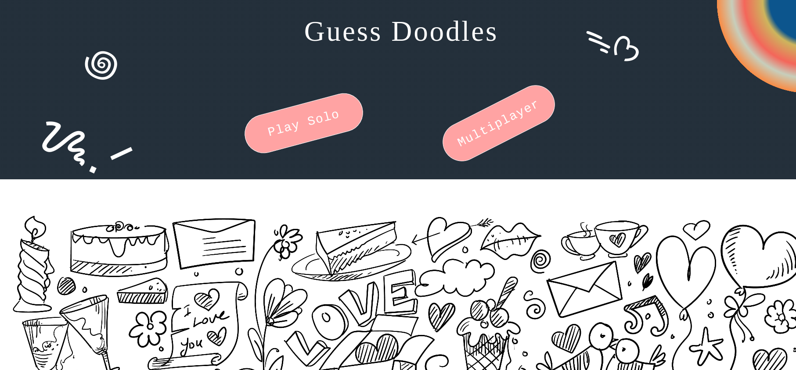
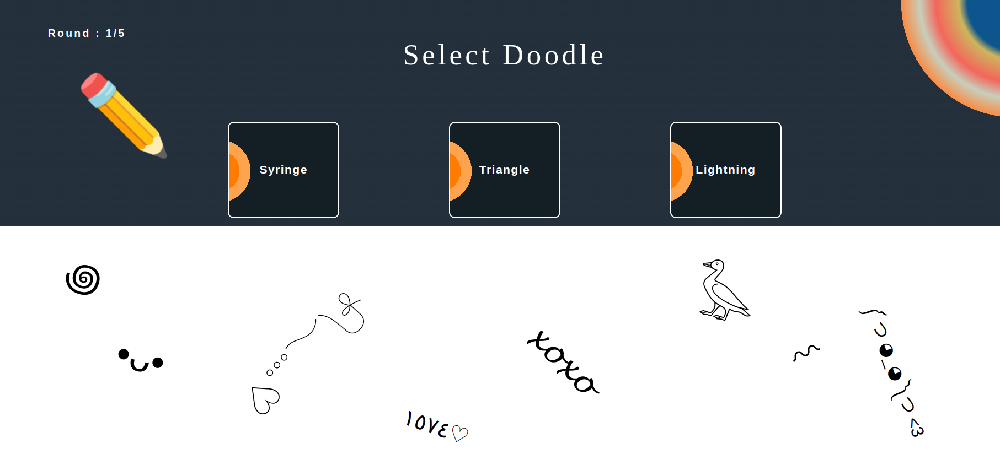
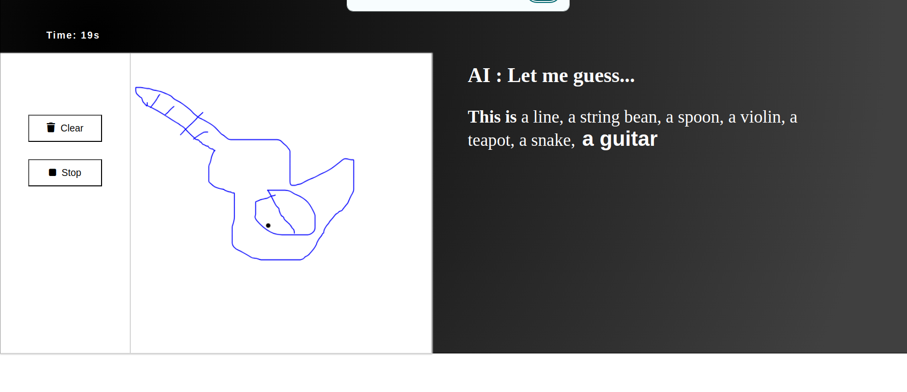
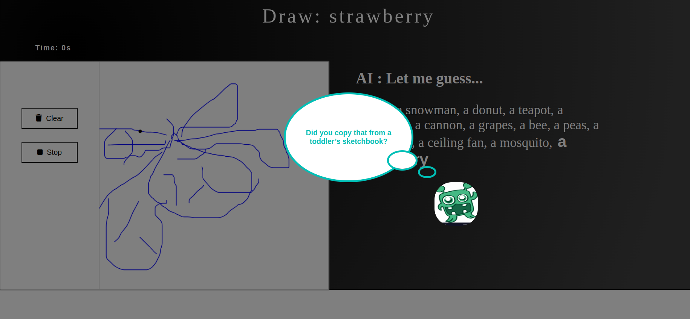
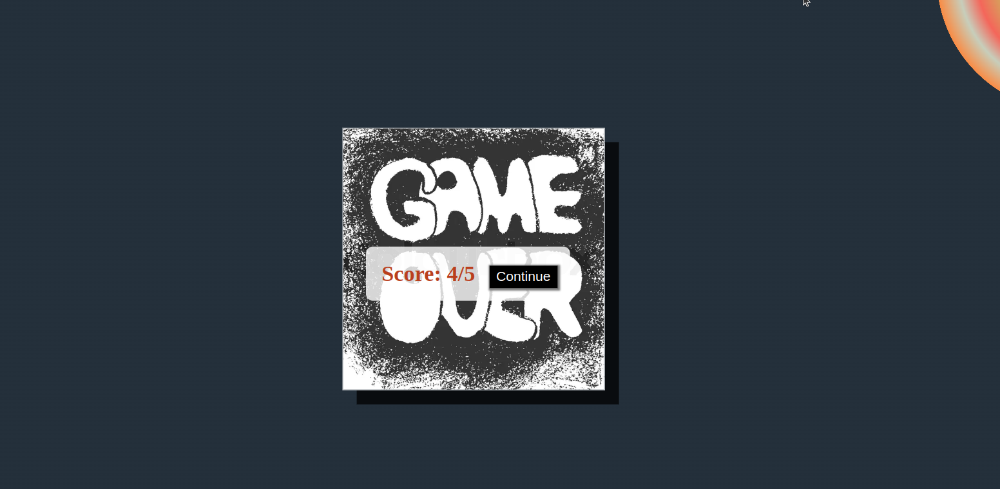

# Sketch n’ Guess
 Doodle Guessing Game is an interactive web-based application that allows users to draw doodles and receive predictions based on a trained Convolutional Neural Network (CNN) model. The frontend is built with **React** and connects to a FastAPI backend that processes images and serves predictions from a trained **CNN** model.

## HOME



## Select Doodle


## Guess



## Hahahaaa



## Well Played



## Features

- **Real-time Predictions**: The app sends the drawn doodle to the backend, which responds with the predicted object.
- **Responsive Design**: Adjusts layout and canvas size based on screen size.
- **Engaging User Interface**: A fun, interactive UI designed to enhance user experience.
- **Trolling**: A playful feature that injects humorous or sarcastic commentary into the user experience.


## Backend and Model Details
- **Backend Repository**: https://github.com/bhav380-2/DoodleBackend_FAST-API
- **CNN Model Training**: https://github.com/bhav380-2/doodleRecognitionModel


## Getting Started

### Installation

1. Clone the frontend repository:

   ```bash
   git clone https://github.com/your-username/DoodleGuessingGameFrontend.git

2. Navigate into the project directory::

   ```bash
   cd /path_to_project

3. Install the dependencies:

   ```bash
   npm install

3. Run Game:

   ```bash
   npm start

## Hosted URL
https://bhav380-2.github.io/DoodleGuessing


